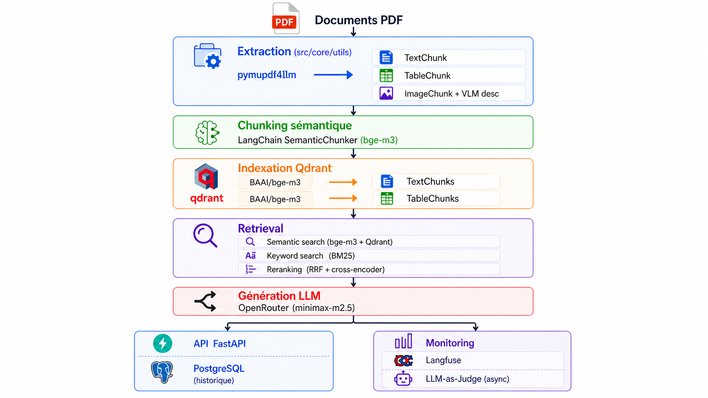

# AgenticRAG

Système de **Retrieval-Augmented Generation** construit avec FastAPI et Next.js. AgenticRAG extrait, indexe et interroge des documents PDF en combinant recherche sémantique, recherche par mots-clés (BM25) et reranking croisé (RRF), avec monitoring Langfuse et évaluation LLM-as-Judge.

---

## Architecture



---

## Structure du projet

```
AgenticRAG/
├── src/
│   ├── core/
│   │   ├── config.py              # Constantes & lazy loading modèles
│   │   ├── utils.py               # Extracteurs PDF, chunkers, utilitaires texte
│   │   ├── exception.py           # AgenticRagException
│   │   └── logging.py             # Configuration des logs
│   ├── entity/
│   │   └── artifact_entity.py     # TextChunk, TableChunk, ImageChunk, DocChunks
│   ├── data/
│   │   ├── chunker.py             # Stratégies de découpe sémantique
│   │   └── data_ingestion.py      # Pipeline d'ingestion complet
│   ├── indexing/
│   │   ├── embedder.py            # Génération des embeddings (bge-m3)
│   │   └── vector_store.py        # Interface Qdrant
│   ├── retrieval/
│   │   ├── semantic_search.py     # Recherche dense (embeddings)
│   │   ├── keyword_search.py      # Recherche BM25
│   │   └── reranker.py            # RRF + cross-encoder reranking
│   └── generation/
│       ├── llm_client.py          # Client LLM (OpenRouter)
│       └── prompts.py             # System prompt & builder de contexte
├── backend/
│   ├── api/
│   │   ├── main.py                # Application FastAPI
│   │   ├── schemas.py             # Schémas Pydantic
│   │   └── dependencies.py        # Injection de dépendances (singletons)
│   └── db/
│       ├── database.py            # SQLAlchemy engine & session (PostgreSQL)
│       └── models.py              # Modèle ORM Message
├── frontend/                      # Interface Next.js (App Router)
│   ├── app/
│   │   ├── page.tsx               # Chat principal
│   │   └── settings/page.tsx      # Tableaux de bord & ré-indexation
│   └── lib/
│       └── api.ts                 # Client HTTP vers le backend
├── monitoring/
│   ├── langfuse_eval.py           # Tracing Langfuse (@observe) + pipeline RAG
│   ├── llm_as_judge.py            # Évaluation automatique (fidélité, pertinence)
│   ├── eval_ragas.py              # Évaluation RAGAS
│   └── benchmark_piaf.py          # Benchmark PIAF
├── datasets/                      # PDFs à indexer (bind-mount Docker)
├── qdrant_storage/                # Données Qdrant persistées (bind-mount Docker)
├── docker-compose.yml             # Déploiement complet (4 services)
├── Dockerfile                     # Image backend Python
├── ingest.py                      # Script d'ingestion standalone
├── pyproject.toml                 # Configuration build, ruff, mypy, pytest
└── requirements.txt
```

---

## Déploiement Docker (recommandé)

### Prérequis

- [Docker Desktop](https://www.docker.com/products/docker-desktop/) ≥ 4.x
- Fichier `.env` à la racine (voir ci-dessous)

### Configuration `.env`

```env
# LLM — OpenRouter
OPENROUTER_API_KEY=sk-or-...

# Monitoring — Langfuse
LANGFUSE_PUBLIC_KEY=pk-lf-...
LANGFUSE_SECRET_KEY=sk-lf-...
LANGFUSE_HOST=https://cloud.langfuse.com

# HuggingFace (pour télécharger bge-m3 en Docker)
HF_TOKEN=hf_...

# PostgreSQL (optionnel — défaut : agenticrag)
POSTGRES_PASSWORD=agenticrag
```

### Lancement

```bash
# Premier démarrage (build des images)
docker compose up --build

# Démarrages suivants
docker compose up

# Arrêt
docker compose down
```

Les services démarrent dans cet ordre grâce aux healthchecks :
1. **Qdrant** (`:6333`) — vector store
2. **PostgreSQL** (interne) — historique des conversations
3. **Backend** (`:8000`) — API FastAPI
4. **Frontend** (`:3000`) — interface Next.js

### Indexation des documents

Déposer les PDFs dans `datasets/` puis lancer depuis le terminal :

```bash
python ingest.py
```

Ou cliquer sur **Re-indexer** dans l'interface (`http://localhost:3000/settings`).

---

## Installation locale (développement)

### Prérequis

- Python 3.12+
- Node.js 18+
- Qdrant accessible (Docker ou local)
- PostgreSQL accessible (optionnel — l'historique est désactivé si absent)

### Backend

```bash
python -m venv .venv
.venv\Scripts\Activate.ps1      # Windows
source .venv/bin/activate        # Linux/macOS

pip install -r requirements.txt
uvicorn backend.api.main:app --reload --port 8000
```

### Frontend

```bash
cd frontend
npm install
npm run dev     # http://localhost:3000
```

### VLM local (descriptions d'images — optionnel)

```bash
ollama pull llava
ollama serve
```

---

## Types de chunks

| Type | Contenu | Indexé dans Qdrant |
|---|---|---|
| `TextChunk` | Paragraphes, titres, listes | Oui (embedding dense) |
| `TableChunk` | CSV des tableaux détectés | Oui (embedding dense) |
| `ImageChunk` | Image base64 + description VLM | Non (description textuelle uniquement) |

---

## API

| Méthode | Endpoint | Description |
|---|---|---|
| `POST` | `/api/query` | Interroger le pipeline RAG |
| `GET` | `/api/stats` | Statistiques de l'index Qdrant |
| `POST` | `/api/ingest` | Ré-indexer les documents |
| `GET` | `/api/health` | Santé du backend et de PostgreSQL |
| `GET` | `/api/conversations/{session_id}` | Historique d'une session |

---

## Monitoring

Le pipeline est entièrement tracé dans **Langfuse** via le décorateur `@observe` :

```
run_rag_pipeline  (trace racine)
  ├── run_retrieval   (span — semantic + BM25 + RRF)
  └── generate_answer (generation — modèle, tokens, latence)
```

Après chaque réponse, un **LLM-as-Judge** évalue en arrière-plan (thread daemon) :
- **Fidélité** — la réponse est-elle supportée par le contexte ?
- **Pertinence** — le contexte récupéré répond-il à la question ?
- **Qualité globale** — note synthétique

Les scores sont remontés comme métriques sur la trace Langfuse.

---

## Stack technique

| Composant | Technologie |
|---|---|
| LLM | OpenRouter (minimax-m2.5) |
| Extraction PDF | pymupdf4llm |
| Embeddings | BAAI/bge-m3 (HuggingFace) |
| Vector store | Qdrant |
| Recherche keyword | BM25 (rank-bm25) |
| Reranking | RRF + cross-encoder (ms-marco-MiniLM-L-12-v2) |
| VLM local | Ollama (llava) |
| API | FastAPI |
| Base de données | PostgreSQL 16 (SQLAlchemy) |
| Frontend | Next.js (App Router) |
| Monitoring | Langfuse v4 |
| Évaluation | LLM-as-Judge |

---

## Auteur

Osman SAID ALI
